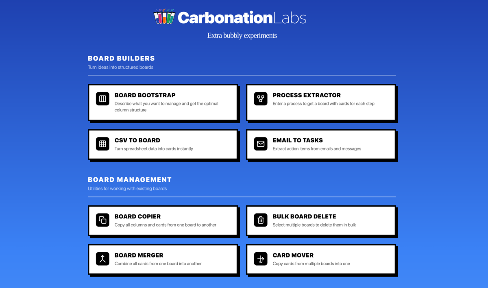

# Carbonation Labs



A Rails application for experiments with [Fizzy](https://fizzy.do) kanban board integration. Each experiment ("lab") helps you create, manage, and populate Fizzy boards in creative ways.

## Requirements

- Ruby 3.4.8
- Rails edge (main branch)
- SQLite 3
- [mise](https://mise.jdx.dev/) (recommended for version management)

## Installation

1. Clone the repository:
   ```bash
   git clone https://github.com/robzolkos/carbonation-labs.git
   cd carbonation-labs
   ```

2. Install dependencies:
   ```bash
   bundle install
   ```

3. Set up environment variables:
   ```bash
   cp .env.example .env
   ```

   Edit `.env` and add your API credentials:
   - `FIZZY_API_TOKEN` and `FIZZY_ACCOUNT_SLUG` - Get from https://fizzy.do/settings/api
   - `OPENROUTER_API_KEY` - Get from https://openrouter.ai/keys
   - `TMDB_API_KEY` (optional) - Get from https://www.themoviedb.org/settings/api for movie poster fetching

4. Set up the database:
   ```bash
   bin/rails db:setup
   ```

5. Start the development server:
   ```bash
   bin/dev
   ```

   This starts both the web server and background job processor (Solid Queue).

## Running Tests

```bash
# Run all tests
bin/rails test

# Run a specific test file
bin/rails test test/controllers/board_bootstrap_controller_test.rb

# Run a specific test by line number
bin/rails test test/models/board_bootstrap_test.rb:21
```

## Linting

```bash
bin/rubocop      # Ruby style checks
bin/brakeman     # Security analysis
bin/bundler-audit # Dependency vulnerability scan
```

## Labs

Labs are organized into five categories:

### Board Builders

Tools that turn ideas into structured Fizzy boards.

| Lab | Description |
|-----|-------------|
| **Board Bootstrap** | Describe what you want to manage and get an optimal column structure generated by AI |
| **Process Extractor** | Enter a process description and get a board with cards for each step |
| **CSV to Board** | Upload spreadsheet data and convert it into cards instantly |
| **Email to Tasks** | Paste emails or messages to extract action items as cards |

### Board Management

Utilities for working with existing Fizzy boards.

| Lab | Description |
|-----|-------------|
| **Board Copier** | Duplicate all columns and cards from one board to another |
| **Bulk Board Delete** | Select and delete multiple boards at once |
| **Board Merger** | Combine all cards from one board into another |
| **Card Mover** | Copy cards from multiple source boards into a single destination |

### Recommendations

Discover and create curated lists powered by AI with web search.

| Lab | Description |
|-----|-------------|
| **Movie Recommender** | Enter movies you love and get personalized recommendations with posters |
| **Book Club Generator** | Build a reading list based on books and genres you enjoy |
| **Gift Idea Generator** | Find perfect gift ideas for anyone based on their interests |
| **Restaurant Bucket List** | Discover must-try restaurants in any city |
| **Trip Planner** | Get a day-by-day itinerary for your next adventure |

### Learning

Study guides and educational resources.

| Lab | Description |
|-----|-------------|
| **Homework Coach** | Get step-by-step help with topics you're struggling with |
| **Learning Path Creator** | Create a structured learning plan for any skill |

### Games

Interactive activities and fun.

| Lab | Description |
|-----|-------------|
| **Movie Quiz Generator** | Generate movie trivia questions with team scoring for quiz night |
| **Party Prompts** | Generate prompts for Charades, Pictionary, or both |

## Architecture

- **Labs Pattern**: Each lab has its own controller and non-ActiveRecord model for form handling and business logic
- **External Integrations**:
  - Fizzy API via `fizzy-api-client` gem
  - LLM via `ruby_llm` gem with OpenRouter
  - TMDB API for movie posters (with Wikipedia fallback)
  - Open Library API for book covers
- **Background Jobs**: Image fetching runs via Solid Queue

## License

This project is licensed under the MIT License - see the [LICENSE](LICENSE) file for details.
